# 有限会社〇〇 ホームページ更改プロジェクト 要件定義書

**文書番号**: RDD-XXX-20251226  
**バージョン**: 1.3.0  
**作成日**: 2025年12月26日  
**対象期間**: 2025年12月27日〜2026年1月4日  
**参加AI**: ChatGPT (OpenAI), Claude (Anthropic), Gemini (Google)  
**プロジェクト責任者**: pimientito

---

## 1. プロジェクト概要

### 1.1 プロジェクト定義

本プロジェクトは、有限会社〇〇のWebサイト更改を目的とするが、その本質は**「生成AIと人間の協働による構築プロセスの実証実験」**にある。成果物としてのWebサイト以上に、その構築・意思決定の軌跡（トレーサビリティ）を主要コンテンツとして定義する。

### 1.2 戦略的背景

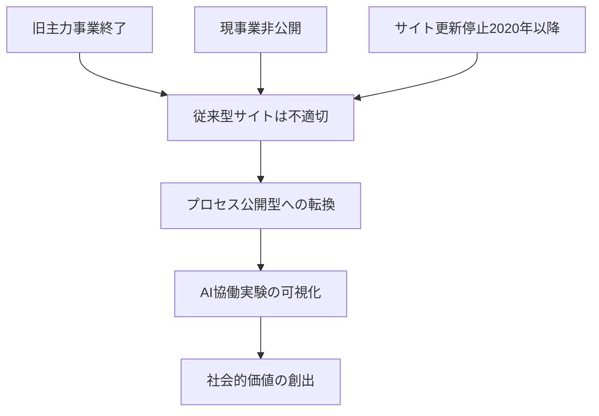

- **現状分析**: 旧主力事業の終了および現事業（SES）の非公開性により、従来型の事業紹介サイトは有効性を喪失
- **戦略転換**: 「事業内容の静的提示」から「知的生産ワークフローの動的公開」へ軸足を移す
- **独自性**: 零細企業の特性を活かし、AIとの対話・齟齬・妥協を含む「開発の舞台裏」を完全可視化

### 1.3 プロジェクト目標

| 目標カテゴリ | 内容 |
|------------|------|
| **主目標** | 非エンジニアによるAI協働型Webインフラ構築の実現性検証 |
| **副目標** | 複数AIモデルを横断した意思決定メソッドの構造化とアーカイブ |
| **成功基準** | 記録の透明性と誠実さ（技術的完成度よりもプロセスの再現性を重視） |

---

## 2. 制約事項と前提条件

### 2.1 ビジネス制約

- **対外的アイデンティティ**: 現時点では「AI協働によるデジタルアセット制作」に特化した表現
- **過去事業の扱い**: 弱電・火災報知設備関連は最小限のアーカイブ情報として扱う
- **現事業**: SES事業は契約上の守秘義務および戦略的理由により非記載

### 2.2 技術制約

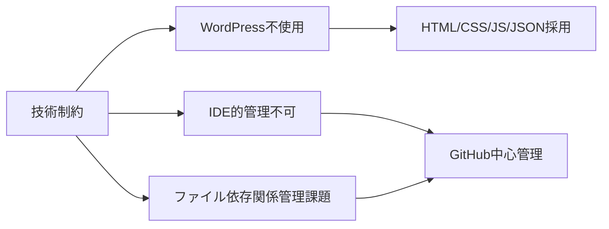

- **非CMSアーキテクチャ**: AIとの親和性および構造の透明性担保のため、プリミティブなWeb技術を採用
- **使用技術**: HTML5, CSS3, JavaScript ES6+, JSON
- **除外技術**: WordPress（AI協働に不適合）
- **IDE管理の代替**: GitHubリポジトリ構造を「Single Source of Truth」と定義
- **サーバOS**: Ubuntu Server（新規構築）
- **開発環境**: VS Code + AI (ChatGPT/Claude/Gemini)

### 2.3 期間制約

- **実証期間**: 2025年12月27日〜2026年1月4日（9日間）
- **運用思想**: Time-boxed Development（タイムボックス開発）を採用
- **フェーズ分割**: 4フェーズ構成（環境構築→実装→テスト→文書化）
- **基本方針**: 期間内の完成度よりも、各フェーズでの意思決定記録を優先

---

## 3. サイト構成要件

### 3.1 インフォメーションアーキテクチャ

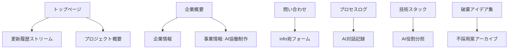

**ページ構造**:
- **トップページ**: プロジェクト理念提示 + ライブ更新履歴（Stream）
- **企業概要**: 法人としての法的情報 + AI協働に特化した事業ステートメント
- **問い合わせ**: info@xxx-xxx.com宛フォーム
- **プロセスログ（核コンテンツ）**: AIとの対話、プロンプト、直面した課題のアーカイブ
- **技術スタック**: 採用技術の選定理由明示
- **破棄アイデア集**: 不採用案の「遺構」的記録

### 3.2 優先順位

1. **必須**: トップ、企業概要、問い合わせ
2. **推奨**: プロセスログ、技術スタック
3. **拡張**: 破棄アイデア集

---

## 4. 機能要件

### 4.1 動的要素の実装方針

| 機能 | 実装方式 | 技術詳細 |
|-----|---------|---------|
| **更新履歴（Live Log）** | JSON管理 + JS動的表示 | `updates.json` をデータソースとするヘッドレス構成 |
| **アクセスカウンター** | テキストファイル保存 | 90年代Web文化へのオマージュ、IPアドレス非保持 |
| **問い合わせフォーム** | JS検証 + SMTP連携 | クライアントサイド・バリデーション + サーバ処理 |

### 4.2 「Work in Progress」可視化機能

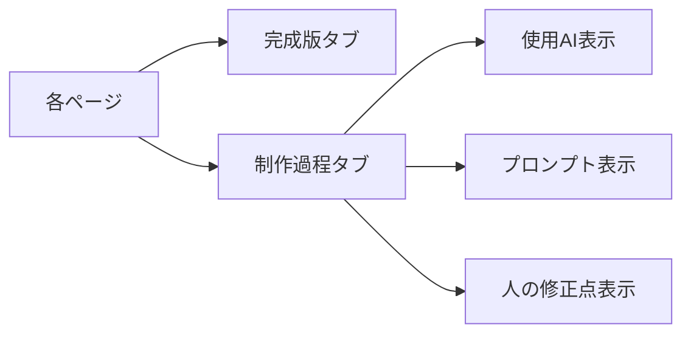

**メタデータ表示**:
- **担当AI**: モデル名（ChatGPT/Claude/Gemini）
- **主要プロンプト**: 使用したプロンプトの要約
- **人間による修正理由**: 判断の根拠を明記

**ステータス・バッジ**:
- Experimental（実験的）
- Stable（安定）
- Under Construction（構築中）

---

## 5. 技術アーキテクチャ

### 5.1 協働ワークフロー

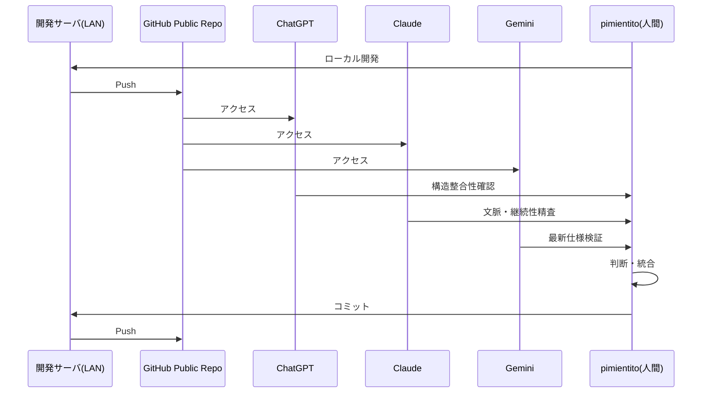

**フロー詳細**:
1. **Local Development**: pimientito氏がLAN内開発サーバにてGit管理
2. **Sync to GitHub**: 公開リポジトリへPush、AIアクセス可能化
3. **Multi-AI Review**:
   - **ChatGPT**: 全体構造の整合性確認
   - **Claude**: 文脈・倫理・継続性の精査
   - **Gemini**: 最新仕様検証およびGoogleツール群との連携確認
4. **Decision & Integration**: 人間が最終的な採用コードを選択しマージ

### 5.2 ハイブリッド・ドキュメント管理戦略

- **GitHub**: 「動くコード」と「技術的判断理由（ADR: Architecture Decision Records）」
- **Google Drive**: ブレインストーミング、未整理の思考、非公開の戦略メモ
- **相互参照**: コミットメッセージにDocs URL記載

### 5.3 技術スタック詳細

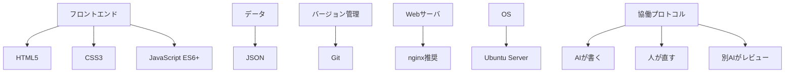

### 5.4 協働プロトコル

**基本ルール**:
1. AIが生成する
2. 人間が修正・判断する（キュレーション）
3. 別のAIがレビューする

この3ステップを明文化し、すべての成果物に適用する。

---

## 6. セキュリティ要件

### 6.1 機密情報の完全隔離

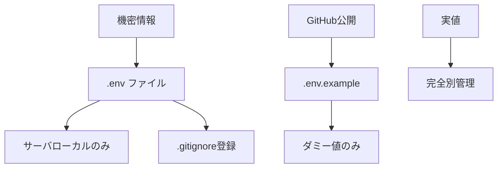

**管理対象**:
- APIキー、パスワード、認証情報
- SSH秘密鍵
- サーバIPアドレス

**運用原則**:
- 環境変数経由でのみ参照
- コード内へのハードコーディング厳禁

### 6.2 インフラ防御（Ubuntu Server）

| 設定項目 | 設定値 | 理由 |
|---------|-------|------|
| **アクセス元** | LAN内特定IPのみ | WAN経由を完全拒否 |
| **ポート** | デフォルト22番から変更 | セキュリティ向上 |
| **認証方式** | 公開鍵認証のみ | パスワード認証無効化 |
| **ファイアウォール** | ufw による最小限のポート開放 | 必要最小限の原則 |
| **対策ツール** | fail2ban | 総当たり攻撃の自動遮断 |

### 6.3 AIとの協働における役割分担

- **AI担当**: 設定ファイル生成、設定検証、セキュリティベストプラクティスの提示
- **人間担当**: IPアドレス等具体値の判断・記入、最終的なセキュリティ判断

---

## 7. 記録要件

### 7.1 記録の優先順位

**「How（手法）」よりも「Why（動機・判断）」の記録に重点を置く**

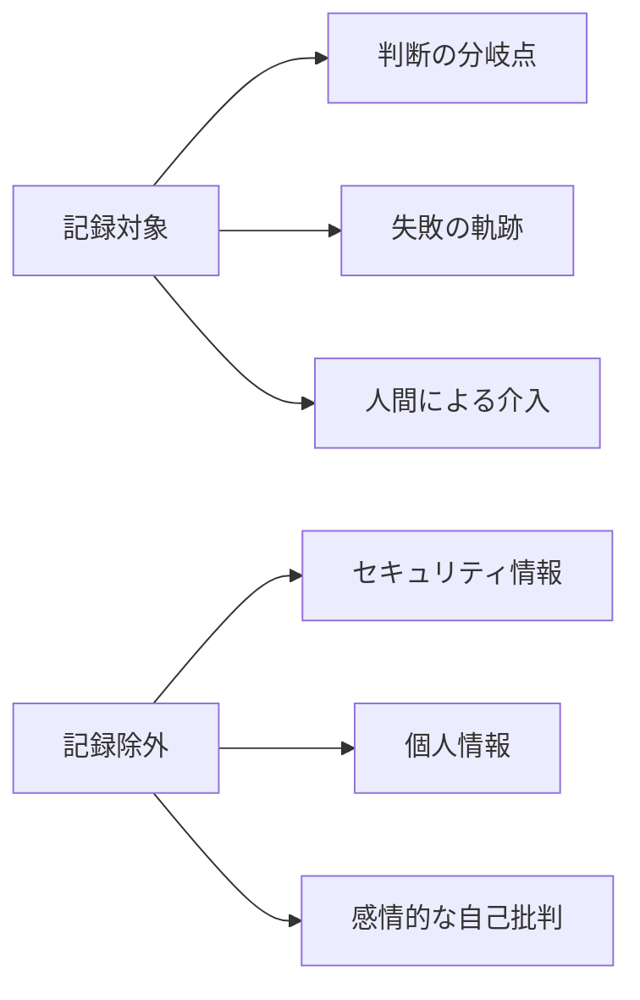

### 7.2 必ず記録すること

1. **判断の分岐点（キュレーションの根拠）**
   - AIが提示した複数の選択肢から一つを選んだ理由
   - 例: 「ClaudeとChatGPT提案が異なる。Claude採用理由は〇〇」

2. **失敗の軌跡**
   - 動かなかったコード（コメントアウトして残す）
   - エラーコード、誤ったプロンプト
   - AIの修正プロセスをそのまま残す

3. **人間による介入（Human-in-the-loop）**
   - 「AIの提案を修正・却下した箇所」こそが本プロジェクトの独自価値
   - 「この部分は人間が判断」と明記

### 7.3 記録除外対象

- セキュリティ情報（APIキー、パスワード、IPアドレス）
- 個人情報（連絡先、顧客情報）
- 感情的な自己批判（記録は「学び」であって「反省文」ではない）

### 7.4 メディアミックス戦略

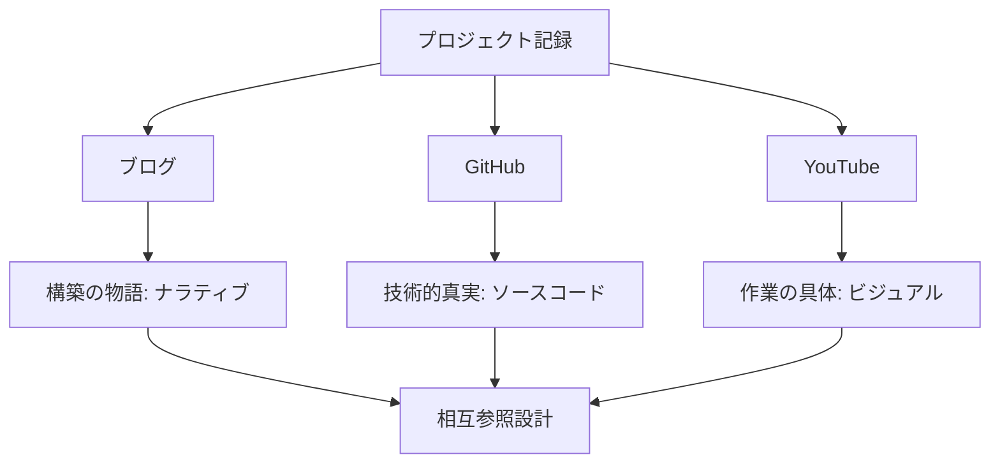

| 媒体 | 主な記録内容 | 形式 |
|-----|------------|------|
| **ブログ** | 構築の物語（ナラティブ）としての記録 | Markdown |
| **GitHub** | 技術的な真実（ソースコード）の記録 | Code + ADR |
| **YouTube** | 作業の具体（ビジュアル）としての記録 | Video |

---

## 8. 実証実験スケジュール

### 8.1 9日間スプリント

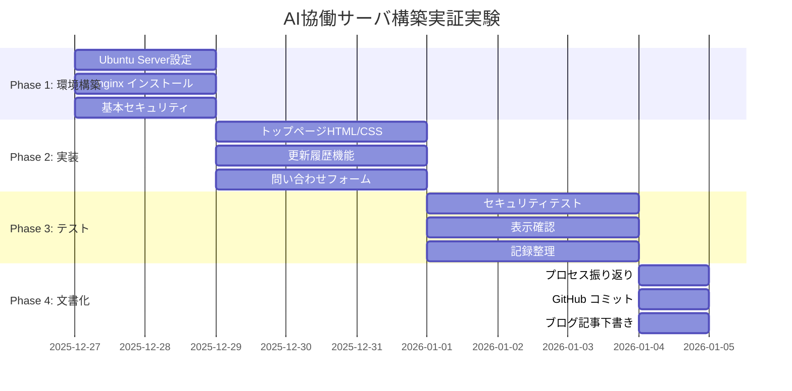

### 8.2 フェーズ別詳細

| 日程 | フェーズ | 重点項目 |
|-----|---------|---------|
| 12/27-28 | **環境構築** | OSセットアップ、nginx設定、セキュリティ強化 |
| 12/29-31 | **コア実装** | 基盤HTML/CSS、JSON連携機能、フォーム実装 |
| 01/01-03 | **検証・調整** | クロスAIレビュー、バグ修正、メタデータ埋め込み |
| 01/04 | **文書化** | 最終コミット、プロジェクト総括記事の公開 |

### 8.3 実証方針

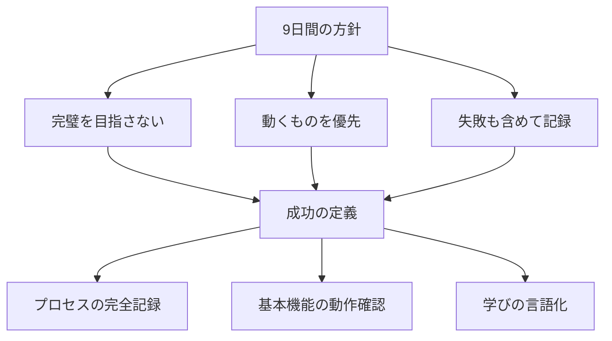

---

## 9. リスク管理

### 9.1 予想リスクと対策

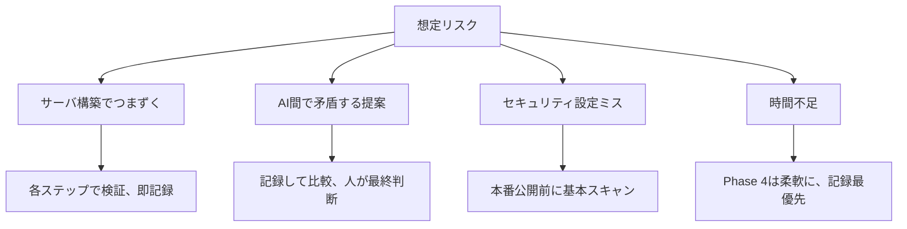

**技術的停滞への対応**:
- 特定のAIの提案でエラーが解消しない場合、別のAIにロールプレイ（「あなたはシニアデバッグエンジニアです」等）を依頼
- 多角的検証を実施

**時間超過への対応**:
- 優先順位の低いページ（破棄案集など）はプレースホルダーのみで公開
- プロジェクト終了後も「Work in Progress」として継続更新

### 9.2 想定される批判への対応

| 批判内容 | 対応戦略 |
|---------|---------|
| 「AIに丸投げ」 | プロンプト試行錯誤を公開、人の判断痕跡（キュレーション）を明示 |
| 「技術的不完全」 | 「Work in Progress」として恒久的に位置づけ、不完全性をコンテンツ化 |
| 「情報が古くなる」 | 「2025年12月時点の記録」と明示、歴史的資料として価値化 |

### 9.3 継続性確保策

- 完成後も「運用プロセス」を公開し続ける
- サイト改善をAIと協働で行い、その過程も記録
- 他者からの質問・フィードバックへの対応も含める

---

## 10. ドキュメント作成方針

### 10.1 基本原則

**冗長化排除、端的な要点伝達**

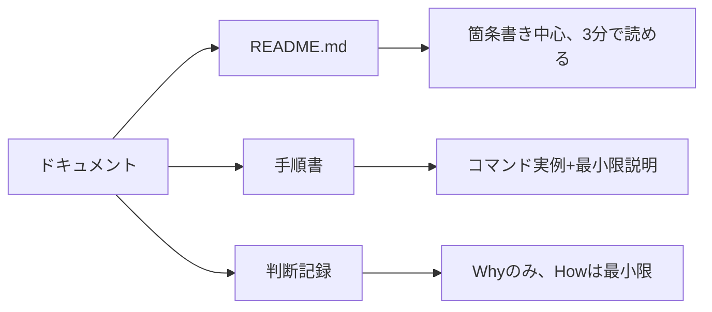

### 10.2 記述例

**❌ 悪い例**:
```
このプロジェクトでは、様々な理由から、複数の選択肢の中で...
（冗長な前置き）
```

**✅ 良い例**:
```
選択: nginx
理由: Apacheより軽量、AI生成コードとの相性良好
```

---

## 11. 追加検討事項

### 11.1 テストの自動化

- HTML/CSS検証ツールの導入
- リンク切れチェック
- セキュリティスキャン（基本的なもの）
- これらもAIに実装させ、その過程を記録

### 11.2 バックアップ戦略

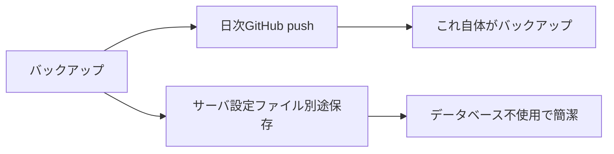

### 11.3 アクセシビリティ

AIに生成させる際に含める指示:
- セマンティックHTML
- alt属性
- キーボード操作対応

---

## 12. AI役割分担

### 12.1 各AIの特性と役割

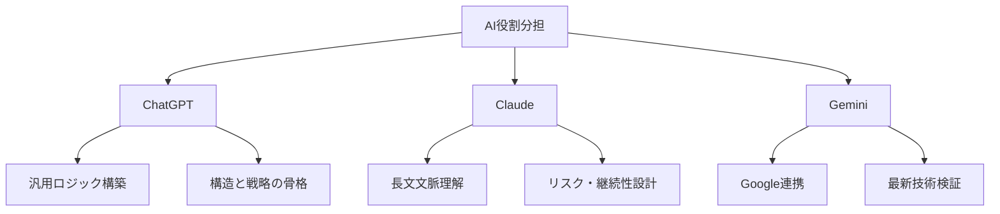

---

## 13. プロジェクトの本質的価値

### 13.1 3層構造

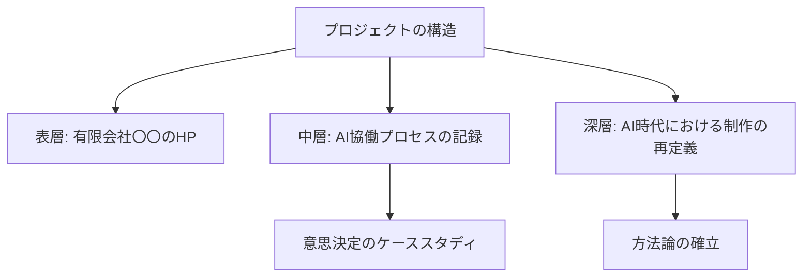

### 13.2 成功の定義

| 項目 | 従来の成功 | 本プロジェクトの成功 |
|-----|----------|------------------|
| **完成度** | 完璧なサイト | 動く最小限のサイト |
| **記録** | 最終成果のみ | ライフサイクル全体の記録 |
| **失敗** | 隠蔽 | 積極的に記録・公開 |
| **価値** | 成果物 | 記録の誠実さ（技術的誠実性） |

---

## 14. プロジェクトの独自性

### 14.1 市場における位置づけ

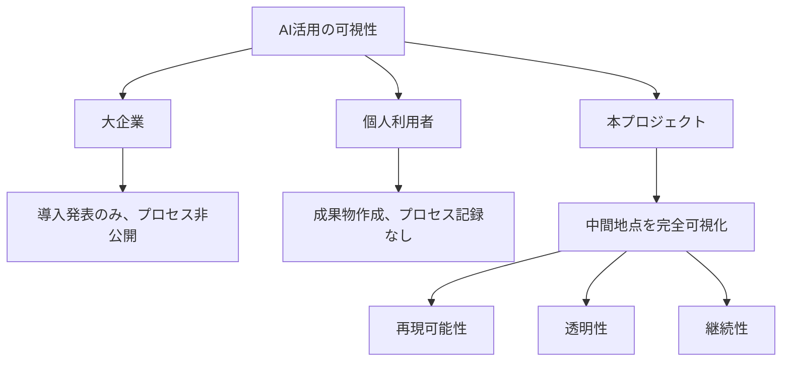

### 14.2 社会的意義

本プロジェクトは以下の価値を提供する：

- **再現可能性**: 他者が同様の取り組みを行う際の参考となる記録
- **透明性**: AIとの協働における判断プロセスの完全可視化
- **継続性**: 完成後も進化し続ける記録として機能

---

## 15. プロジェクトの本質

### 15.1 根本的な位置づけ

本プロジェクトは**「不完全であることをコンテンツとする」**という逆説的アプローチにより、AI時代の技術との向き合い方を提示する。

成功の定義は「綺麗なWebサイト」ではなく、**「9日間で人間とAIがどこまで歩み寄れたか」の純粋なログの量と質**に依拠する。

### 15.2 守るべき3原則

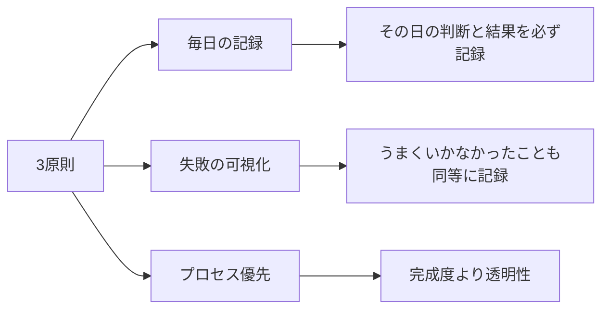

### 15.3 プロジェクトの核心的価値

本プロジェクトの核心的価値は、「非エンジニアがAIと協働してサーバを構築できるか」という実験の率直な記録そのものにある。

これは「失敗できないプロジェクト」ではなく、「失敗を記録するプロジェクト」である。

---

## 16. 用語集

| 用語 | 定義 |
|-----|------|
| **AI協働** | 人間とAIが対等なパートナーとして協力する作業形態 |
| **プロセス公開型** | 成果物ではなく制作過程を主コンテンツとするサイト形態 |
| **Work in Progress** | 恒久的に「制作中」状態を保つ設計思想 |
| **自己言及ループ** | AI対話記録だけが連続し、人の判断が見えなくなるリスク |
| **協働プロトコル** | AI・人間の役割分担と連携手順を定めたルール |
| **キュレーション** | AIの複数提案から人間が選択する行為 |
| **Human-in-the-loop** | 人間による介入が本質的価値を持つという概念 |
| **ADR** | Architecture Decision Records（技術的判断理由の記録） |
| **Single Source of Truth** | 唯一の信頼できる情報源（本プロジェクトではGitHub） |
| **Time-boxed Development** | 期間を固定し、その中で達成可能な範囲を優先する開発手法 |
| **技術的誠実性** | Technical Integrity、不完全性を隠さず公開する姿勢 |

---

## 17. 参照ドキュメント

- **ブレインストーミング記録**: `20251226_brain_meeting_for_ArteHomepage_renewal.md`
- **現行サイト調査**: `20251226_research_Arte_Homepage.md`
- **GitHubリポジトリ**: (実証実験開始時に作成)

---

## 18. 変更履歴

| 日付 | バージョン | 変更内容 | 担当 |
|-----|-----------|---------|------|
| 2025-12-26 | 1.0.0 | 初版作成（ブレインストーミング統合） | Claude |
| 2025-12-26 | 1.1.0 | 表現整理・重複削減（ChatGPTレビュー） | ChatGPT |
| 2025-12-26 | 1.2.0 | 妥当な指摘のみ反映、本質的内容保持 | Claude |
| 2025-12-26 | 1.3.0 | 語彙多様化、論理的整合性強化、セキュリティ詳細化 | Claude + Gemini |

---

## 19. 承認

| 役割 | 氏名 | 承認日 | 署名 |
|-----|------|-------|------|
| プロジェクト責任者 | pimientito | 2025-12-26 | |
| AI協働パートナー | ChatGPT | 2025-12-26 | ✓ |
| AI協働パートナー | Claude | 2025-12-26 | ✓ |
| AI協働パートナー | Gemini | 2025-12-26 | ✓ |

---

**文書終了**

_このドキュメントは生成AI（ChatGPT, Claude, Gemini）との協働により作成されました_

---

## 20. 次のステップへの提案

明日（12/27）から実証実験のPhase 1が開始されます。

**推奨される準備作業**:
- Ubuntu Server初期セットアップ用チェックリスト作成
- AIへの指示用プロンプト準備
- GitHubリポジトリの初期構造定義
